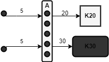

# Kevin el Encargado

#### Integrantes

- Mauricio Mahmud Sánchez C412 
- Raúl Beltrán Gómez C412 

---

# Problema 

Kevin ha sido puesto al frente de la comisión de la facultad que elegirá las fechas de las pruebas de los k cursos que se dan en la facultad.

Cada curso tiene una cantidad de pruebas determinadas que quiere poner, y propone para esto, por ejemplo, los días { 17, 34, 65 y 87 } del curso escolar, si vemos a este como una sucesión de días en los que se imparten clases. Para mostrarse flexibles, los cursos a veces elaboran más de una propuesta incluso.

Por un problema de desorganización las propuestas se regaron y ahora no se sabe que curso propuso que propuesta, pero ya Kevin esta cansado de tanta gestión. Kevin quiere elegir k propuestas que ninguna quiera poner pruebas el mismo día que las otras, así supone que todo el mundo estará contento, ayude a Kevin.

## Set Packing Problem

El problema de Set Packing (Empaquetamiento de conjuntos) es un problema NP-Completo y se puede describir formalmente de la siguiente manera:

Dado un conjunto universal $U$, una colección $S$ de subconjuntos de $U$ y un entero positivo $k$, se busca determinar si existen $K$ subconjuntos de $S$ que sean disjuntos entre sí (es decir, que no compartan elementos) tal que $K >= k$.

## Demostración

Reduzcamos el problema set packing al nuestro. 

1. Se toma el conjunto universal $U$ como el conjunto de días del curso, osea se remplaza cada elemento del conjunto $U$ por un día del curso donde no existen dos elementos de $U$ asignados al mismo día.
2. Cada uno de los subconjuntos se toman como una propuesta existente.
3. Se toma $k$ como las propuestas a elegir.

Esta reducción se puede hacer de manera lineal, ya que solo habría que sustituir por numeros los elementos.

Una vez resuelto el problema dado, se tiene (si existen),  el conjunto de tamaño $k$ de propuestas. Luego se tendria la solución del problema Set Packing ya que existiría un conjunto con cardinalidad mayor o igual que $k$ de subconjuntos disjuntos si existe este conjunto, de lo contrario la respuesta es negativa en Set Packing. 

Por lo anterior expuesto si el problema dado tiene una complejidad polinomial podríamos resolver el problema Set Packing en tiempo polinomial, lo cual conocemos que no es posible ya que este es NP-Completo. Luego el problema dado, si existe una solucion determinista a este, tiene que ser no polinomial. 

## Solución

Por cada uno de los subconjuntos dados se va a comprobar que la interseccion sea nula con un conjunto acumulado (inicialmente en el conjunto vacío), cada vez que se evalue si un subconjunto tiene intersección nula con el conjunto acumulado se va a unir a este formando parte de el de ser cierto, esto se va hacer recursivamente hasta que se llegue a que se han unido k subconjuntos al conjunto acumulado, de no lograrse llegar a los k subconjuntos unidos, el problema no tiene solución.

#### Complejidad
La complejidad de recorrer los n subconjuntos por cada entrada recursiva seria en total $O(n^n)$ esto no es necesario, pues la operación que se va a llevar a cabo es la intersección o unión la cuál es simétrica por lo que no es necesario comprobar si un conjunto anteriormente comprobado tiene intersección nula con el actual (pues ya vamos a haberlo comprobado) por lo que sería $O(n!)$, también hay que hacer la unión de dos conjuntos en cada entrada recursiva, esto tiene complejidad $O(m)$ siendo $m$ la máxima cantidad de elementos(días), luego la complejidad final sería $O(m·n!)$ siendo $m$ la cantidad de días máxima que tiene una propuesta y $n$ la cantidad de propuestas. 

## Heurística

La heuristica que utilizamos en nuestra solución fue darle un orden de selección al backtrack, de tal forma que en caso de existir, en un gran número de casos, la solución del ejercicio sea encontrada mas rápida. Para ello en cada iteración del backtrack se entra en orden de: Cuál es la propuesta que menos cantidad de intersecciones posee, y se entra recursivamente en esta. Esta selección de heurística esta dada en gran medida por un proceso de simulación de casos random, donde se compara la respuesta de solo ir iterando por la propuesta de menor intersección en cada paso, con la solución del backtrack, obteniedo en casos estos casos mas de un 99% de acertacion. Esta heurística esta basada en las heurísticas greedy utilizadas técnicas de búsqueda local para la solucion del problema NP-Completo “Maximal independent set”. 

El problema “Maximal independent set” consiste en hallar el conjunto independiente maximo de un grafo. Notese que en nuestro caso seria el equivalente a hallar el conjunto independiente de tamanno k de un grafo, lo cual si se agregar vertices iterativamente para buscar un conjunto es, a los efectos, una manera de buscar hasta el tamanno k. La diferencia entre estos algoritmos con heuristica es que nosotros disponemos de un k que es condicion de parada del algoritmo, en el caso del problema “Maximal independent set” se busca el mayor de todos estos conjuntos. Para el caso de nuestro problema tiene sentido darle orden al back-track dado que si existe el k y se encuentra el algoritmo debe parar, lo cual implica que encontrar el conjunto de tamanno k mas rapido puede agilizar la velocidad del algoritmo en casos que exista la solucion. 

Sea $G(V,E)$ un grafo, donde cada vertice, si esta conectado a otro por una arista, entonces estos tienen una interseccion de las fechas de la propuesta, veamos cada vertice como una propuesta y cada arista como que ambas propustas tienen interseccion y por ende no pueden existir ambas en la solucion, luego nuestro problema se reduce a buscar, si existe, un conjunto independiente de tamanno $k$. Veamos los casos especificos donde el algoritmo no sera agilizado por la heuristica planteada:

- En caso que no exista un conjunto independiente de tamanno $k$, entonces el back-track se ejecutara hasta el final buscando una solucion que no existe y pasara por todas las combinaciones posibles.
- En caso que el grafo de divida en $Kn$ por un lado(un subgrafo completo), cada uno de los vertices de $Kn$ este conectado a un conjunto independiente te tamanno $a$, llamamoslo $A$, y por otro lado existan vertices conectados al conjunto $A$, de tal forma que estos vertices tengan menor degree que los vertices de $A$. Notese que en $A$ cada vertice tendra como degree $n+x$, donde $x$ es la cantidad de nodos conectados a $A$ que no pertenecen a $Kn$. Si usamos a los vertices conectados a $A$ en la solucion entonces los vertices de $A$ no pueden existir a la misma. Luego la solucion puede ser $A$ como conjunto independiente pero en las primeras iteraciones del back-track este no sera priorizado. En casos como este y similares, el algoritmo tambien puede recorrer todas las iteraciones de su complejidad. En el siguiente ejemplo podemos ver un caso donde el conjunto solucion sera lo ultimo que se tendra en cuenta:

*En este caso los vertices de la izquierda estan conectados a los $5$ vertices de $A$, los vertices de $A$ estan conectados a todos los vertices de $K20$, $A$ tiene cardinalidad $5$, ademas los vertices de $A$ estan conectados a todos los vertices de $K30$. Siguiendo la idea planteada cada vertice de $A$ tendria $degree = 52$, cada vertice de $K20$ tendria $degree = 24$, cada vertice de K30 tendria degree de $34$, cada vertice a la izquierda tendria $degree = 5$. Luego en el orden de prioridades, los vertices que pertenecen a $A$ serian los ultimos en revisarse y el algoritmo se recorreria complete para un $k = 5$.*

